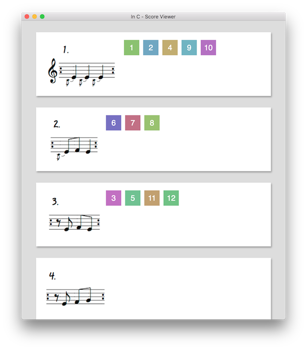
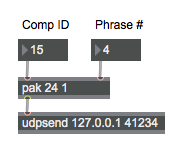

# In C - Score Progress

This is a simple Electron app for displaying score progress on a projector
during laptop performances of [Terry Riley's *In C*][inC]. It is designed to be
used with [Max][max], but it could be used with other software.
Supports Windows, macOS, and Linux.

If you are performing with us in an upcoming event, you do **not** need to
download this application. It is intended for organizers of *In C* performances
and is not required.



## Usage

This app works by having each performer report a identification number unique
to their computer and the phrase they are currently performing. Our
[In C performance app][inCApp] supports this app out-of-the-box, and no additional
configuration is necessary.

If you are building your own performance app this information can be replicated in
Max as a list of two integers, specifically the ID number followed by the
phrase number. All messages should be sent to port number `41234` on the
computer hosting this app. Below is an example Max patch that sends a message
to the correct port on your local machine, assuming you are hosting the app:



## Downloads

**Version 1.1.0 ([downloads][v1.1])**

* [Windows x64](https://github.com/loyola-university-tech-ensemble/in-c-score-progress/releases/download/v1.1.0/InCScoreProgress-win32-x64.zip)
* [macOS](https://github.com/loyola-university-tech-ensemble/in-c-score-progress/releases/download/v1.1.0/InCScoreProgress-macos-x64.dmg)
* [Linux x64](https://github.com/loyola-university-tech-ensemble/in-c-score-progress/releases/download/v1.1.0/InCScoreProgress-linux-x64.zip)

**Version 1.0.0 ([downloads][v1])**

* [Windows x64](https://github.com/gmoe/in-c-score-progress/releases/download/v1.0.0/InCScoreProgress-win32-x64.zip)
* [macOS](https://github.com/gmoe/in-c-score-progress/releases/download/v1.0.0/ScoreProgressMacOS.dmg)
* [Linux x64](https://github.com/gmoe/in-c-score-progress/releases/download/v1.0.0/InCScoreProgress-linux-x64.zip)

## Local Development

Building the app locally requires generating the phrases from the Lilypond source code
which requires at least version 2.19.80. See our [phrase repository][phrases] for additional
context. If you are performing *In C* none of this is required.

If you already have the correct version of Lilypond installed simply run the build script
at the root of the repository. After that you can boot up the application, you are only
required to generate the phrase assets once.

```sh
$ ./build-ly.sh
$ npm start
```

## About

Created for the Loyola University (Chicago) Technology Ensemble, Fall 2016.

Copyright (c) 2020 Griffin Moe. Released under [MIT license](LICENSE.md).

[inC]: https://en.wikipedia.org/wiki/In_C
[inCApp]: https://github.com/loyola-university-tech-ensemble/InC
[max]: https://cycling74.com/max7/
[v1]: https://github.com/gmoe/in-c-score-progress/releases/tag/v1.0.0
[v1.1]: https://github.com/gmoe/in-c-score-progress/releases/tag/v1.1.0
[phrases]: https://github.com/loyola-university-tech-ensemble/in-c-phrases-ly
